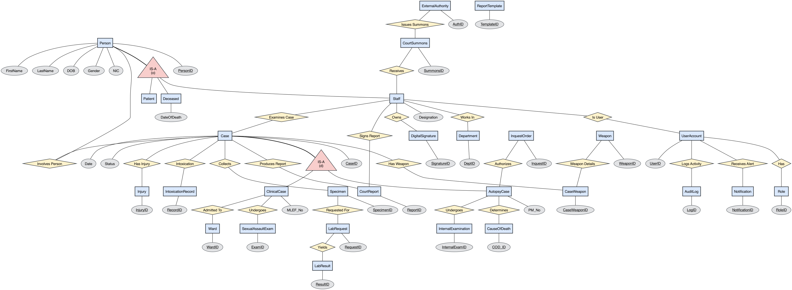

# Medico Forensic DBMS — Department of Forensic Medicine Management System

---

## Team RoboZen404
- E/22/044, D.M.N.N. Bandara, [e22044@eng.pdn.ac.lk](mailto:e22044@eng.pdn.ac.lk)
- E/22/102, A.K. Gamage, [e22102@eng.pdn.ac.lk](mailto:e22102@eng.pdn.ac.lk)
- E/22/010, A.A.D.I. Adikari, [e22010@eng.pdn.ac.lk](mailto:e22010@eng.pdn.ac.lk)
- E/22/211, H.M. Liyanage, [e22211@eng.pdn.ac.lk](mailto:e22211@eng.pdn.ac.lk)

Department of Forensic Medicine, Teaching Hospital Peradeniya

#### Table of Contents
1. [Introduction](#introduction)
2. [Database Architecture & Conceptual Design](#database-architecture--conceptual-design)
3. [Conclusion](#conclusion)
4. [Links](#links)

---

## Introduction

The Department of Forensic Medicine at the Teaching Hospital Peradeniya handles critical clinical forensic cases (e.g., trauma, domestic abuse, sexual violence) and postmortem autopsy examinations. Currently, the department relies on physical registers, manual paper-based Medico-Legal Examination Forms (MLEF), and paper Postmortem Reports (PMR). 

This manual workflow creates critical operational bottlenecks:
- **Inefficient Record Retrieval:** Manual indexing makes tracing historical patient cases or matching court summonses to physical files extremely slow.
- **Chain of Custody Vulnerabilities:** Tracking forensic biological specimens, toxicology samples, weapons, and laboratory results across physical logbooks risks misplacement or record gaps.
- **Data Confidentiality & Granular Access Control:** Sensitive autopsy findings, sexual assault details, and clinical notes lack strict digital role-based privilege restrictions.
- **Report Compilation Delay:** Assembling Medico-Legal Reports (MLR) for court submissions requires manual transcription from multiple unlinked paper records.

**Medico Forensic DBMS** is a relational database system engineered specifically to digitize, secure, and streamline the operational workflows of the Forensic Department. The primary objective of this project is to implement a robust, normalized relational schema that guarantees ACID compliance, enforces referential integrity constraints, maintains chain-of-custody logging via specimen tracking, and optimizes complex SQL queries for legal report compilation.

---

## Database Architecture & Conceptual Design

The core of this system is designed around strict relational database principles to ensure minimal redundancy, high data integrity, explicit specialization via superclass/subclass inheritance, and structured query optimization.

Figure 1 — Enhanced Entity-Relationship (EER) Diagram of the Forensic Database

### Entity-Relationship Breakdown

The system schema utilizes Enhanced Entity-Relationship (EER) design patterns, incorporating superclass/subclass hierarchies for person demographics and forensic cases, alongside specialized examination entities:

| Component | Entity Name | Primary Key | Key Attributes & Foreign Key (FK) Links | Operational Role |
|---|---|---|---|---|
| **Person Inheritance (EER)** | `Person` (Superclass) | `PersonID` | `FirstName`, `LastName`, `DOB`, `Gender`, `NIC` | Base superclass storing universal human demographic attributes. |
| | `Patient` (Subclass) | `PatientID` | `PersonID` (FK/PK), `Address`, `EmergencyContact` | Subclass representing living clinical forensic patients. |
| | `Deceased` (Subclass) | `DeceasedID` | `PersonID` (FK/PK), `DateOfDeath`, `TimeOfDeath` | Subclass representing deceased individuals for autopsy. |
| | `Staff` | `StaffID` | `PersonID` (FK), `UserID` (FK), `DeptID` (FK), `FirstName`, `LastName`, `Designation` | Subclass representing department employees (JMOs, doctors, technicians). |
| **Administration & Access** | `Department` | `DeptID` | `DeptName`, `Location` | Stores organizational departments. |
| | `Ward` | `WardID` | `Name`, `HospitalLocation` | Tracks hospital ward details for in-ward clinical referrals. |
| | `UserAccount` | `UserID` | `RoleID` (FK), `Username`, `PasswordHash`, `IsActive` | Encapsulates system logins and active user status. |
| | `Role` | `RoleID` | `RoleName`, `Permissions` | Stores Role-Based Access Control (RBAC) permission definitions. |
| | `AuditLog` | `LogID` | `UserID` (FK), `Action`, `Timestamp` | Records audit trails for data security and compliance. |
| | `Notification` | `NotificationID` | `UserID` (FK), `Message` | Generates system alerts for pending reports or court dates. |
| **Case Inheritance (EER)** | `Case_Table` (Superclass) | `CaseID` | `CaseDate`, `Status` | Superclass capturing universal case metadata. |
| | `ClinicalCase` (Subclass) | `ClinicalCaseID` | `CaseID` (FK/PK), `PatientID` (FK), `JMO_StaffID` (FK), `WardID` (FK), `MLEF_No`, `AdmissionDate` | Subclass digitizing the Medico-Legal Examination Form (MLEF). |
| | `AutopsyCase` (Subclass) | `AutopsyCaseID` | `CaseID` (FK/PK), `DeceasedID` (FK), `JMO_StaffID` (FK), `PM_No`, `PlaceOfDeath` | Subclass digitizing the Postmortem Report (PMR). |
| **Specialized Examinations** | `SexualAssaultExam` | `ExamID` | `ClinicalCaseID` (FK), `HymenStatus` | $1:1$ clinical extension capturing specific examination details for sexual assault cases. |
| | `InternalExamination` | `InternalExamID` | `AutopsyCaseID` (FK), `HeadDetails`, `ThoraxDetails`, `AbdomenDetails` | Organ-by-organ internal autopsy findings. |
| | `CauseOfDeath` | `COD_ID` | `AutopsyCaseID` (FK), `ImmediateCause`, `AntecedentCause` | Stores multi-level causes of death. |
| **Legal & Authorities** | `ExternalAuthority` | `AuthID` | `Name`, `Type`, `ContactInfo` | Stores details of courts, police stations, and external institutions. |
| | `InquestOrder` | `InquestID` | `AutopsyCaseID` (FK), `AuthorityID` (FK), `CaseNumber`, `DateOfIssue` | Links Magistrate / Inquirer sudden death orders to autopsy cases. |
| | `CourtSummons` | `SummonsID` | `StaffID` (FK), `AuthorityID` (FK), `CaseNo`, `RequiredDate` | Manages court summons dates for attending JMOs. |
| | `CourtReport` | `ReportID` | `CaseID` (FK), `ReportType`, `SignedByStaffID` (FK) | Stores finalized MLR and PMR document records. |
| **Evidence & Laboratory** | `Injury` | `InjuryID` | `CaseID` (FK), `Type`, `Dimensions`, `Location` | Maps specific injuries (abrasions, fractures) on cases. |
| | `IntoxicationRecord` | `RecordID` | `CaseID` (FK), `SubstanceType`, `Consumed` | Logs alcohol, drug, or poison screening findings. |
| | `Specimen` | `SpecimenID` | `CaseID` (FK), `SpecimenType`, `CollectedDate` | Biological and physical sample chain of custody tracking. |
| | `LabRequest` | `RequestID` | `SpecimenID` (FK), `TargetLabID` (FK), `Status` | Tracks laboratory investigation orders sent to external labs. |
| | `LabResult` | `ResultID` | `RequestID` (FK), `ResultDetails`, `ReceivedDate` | Stores lab investigation findings received from testing centers. |
| | `Weapon` | `WeaponID` | `Type`, `Description` | Master table storing weapon classifications. |
| | `CaseWeapon` | `CaseWeaponID` | `CaseID` (FK), `WeaponID` (FK), `Details` | Bridge entity linking weapons involved in specific cases. |

---

## Conclusion

The **Medico Forensic DBMS** delivers a database infrastructure engineered for the Department of Forensic Medicine at Teaching Hospital Peradeniya. By shifting from paper registers to a normalized relational schema with explicit superclass/subclass inheritance, the system guarantees data integrity, preserves the chain of custody for specimens and weapons, enforces access control over sensitive records, and speeds up court report aggregation.

Key Architecture Achievements:
- An Enhanced Entity-Relationship (EER) schema utilizing specialization/generalization hierarchies (`Person` and `Case_Table` superclasses).
- Complete coverage of clinical (MLEF), autopsy (PMR), sexual assault, toxicology, and laboratory investigation workflows.
- Strict enforcement of referential integrity, foreign key constraints, role-based access controls, and audit logging.
- Structured data views enabling efficient court-ready Medico-Legal Report (MLR) generation.

---

## Links

- [Project Repository](https://github.com/cepdnaclk/{{ page.repository-name }}){:target="_blank"}
- [Project Page](https://cepdnaclk.github.io/{{ page.repository-name}}){:target="_blank"}
- [Department of Computer Engineering](http://www.ce.pdn.ac.lk/)
- [University of Peradeniya](https://eng.pdn.ac.lk/)
